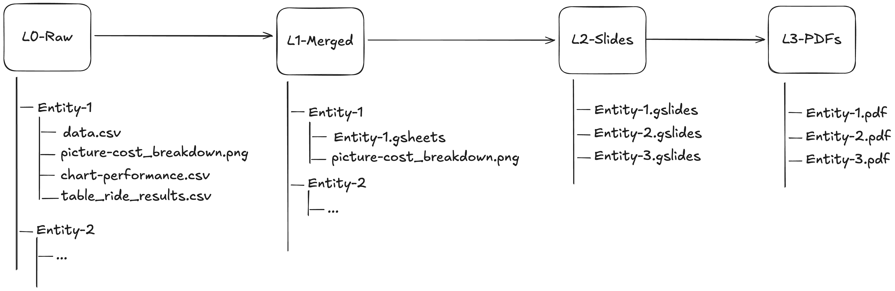

# Google Slides Automator 📠

This repository contains a python package for generating Google Slide reports for different combinations of entities. It works by replacing placeholders in a slide template with data from a Google Sheets for each entity.

Following elements in a slide can be replaced,
1. Text placeholders in a paragraph
2. Charts
3. Tables
4. Pictures

The real value of this package is the ability to generate a report for different entities. By providing the raw data for each entity the package in a structured format, the code can generate reports for each entity. This is useful when you have a large number of entities and you want to generate reports of the same structure.

## Getting Started

Requirements to run the package are:

1. Python 3.11 or above.
2. Google Sheets, Slides and Drive API enabled Google Clouds service account credentials.
3. A shared Google Drive containing slide and data templates and raw data.

### Service Account Setup

1. Create a service account in Google Cloud Console with the following scopes:
   - https://www.googleapis.com/auth/spreadsheets
   - https://www.googleapis.com/auth/drive.readonly
   - https://www.googleapis.com/auth/drive.file
   - https://www.googleapis.com/auth/drive
   - https://www.googleapis.com/auth/presentations
2. Download the JSON key file and save it as `service-account-credentials.json` file.
3. **Important**: Give full access to the service account email (found in the JSON file as `client_email`) to the shared drive where the reports will be generated.

If you see "File not found" errors when trying to delete files, it means the service account doesn't have access to those files. The error messages will include the service account email that needs to be granted access.

## How it works

The package works exclusively on **Shared Google Drive** files only. One of the inputs to the package will be a Google Drive folder id. The package expects the Google Drive to have the exact structure as below.

```
/
├── L0-Raw/
├── L1-Merged/
├── L2-Slide/
├── L3-PDF/
├── Templates/
│   ├── slide-template.gslide
│   ├── data-template.gsheet
│   └── ...
└── entities.csv
```
- **Templates** - This folder contains 2 files. A data template gsheet file and a slide template gslide file. Users of the library need to provide the slide template and the data template in this folder. Data template is used to generate the charts from the raw data and the slide template provides structure of the report with placeholders for the data.
- **L0-Raw** - This folder contains the raw data for each entity. This folder will have sub folders for each entity. Each entity folder will have the raw data for each slide and also the pictures used in the slides. Users of the library need to provide the raw data in this folder.
- **L1-Merged (Auto Generated)** - This folder contains the processed and structured spreadsheet per entity, used to generate charts. This folder will have sub folders for each entity. Each entity folder will have a spreadsheet for each slide and also the pictures used in the slides. This folder is automatically generated by the library.
- **L2-Slide (Auto Generated)** - This folder contains the Google Slide reports for each entity. These are generated by cloning the slide template and replacing the placeholders with the data from the L1-Merged sheet. This folder is automatically generated by the library.
- **L3-PDF (Auto Generated)** -   This folder contains the PDF reports for each entity. These are generated by converting the Google Slide reports to PDF format. This folder is automatically generated by the library.
- **entities.csv** - A csv with four columns: first column is the entity name (like Volvo, Audi if entities are cars); the second column `L1` controls transformation for L0 to L1. It accepts a Y to process or N/empty to skip. The third column `L2` controls the slides to be generated for the entity. It accepts a number or a range of numbers or a combination of both like `1,2,3` or `1-3` or `1,2,3,5-7`. If you want to generate all slides, you can use `All` or leave it empty to not process slides. The fourth column `L3` controls the generation of the PDF report. It accepts a Y to process or N to skip/empty to skip. Users of the library need to provide the entities.csv file in the root of the drive.

Following is a workflow diagram to understand the flow.



To understand the data better refer to the drive below which contains sample data for a couple of bike dealers.

https://drive.google.com/drive/u/0/folders/0AIQQEzDV8s96Uk9PVA

### Per Slide L2 Generation

When generating the whole slide in L2, the template is cloned into the destination folder. But due to limitations in the Google Slide API, we can't copy single slides from another presentation. We've overcome this limitation by recreating the slide using API by copying all individual elements. This generally works well, except for the following scenarios.

#### 2. Per slide L2 generation for tables

Using the entities.csv you can re-generate specific slides. However, due to limitations in the Google Slides API certain properties (like padding) of elements are not returned when fetching them. This causes those elements to look different from the template and this is obviously noted in tables.

Due to this, the code will ask for a confirmation from the user to accept the risk like below.

```
⚠️  Slide(s) 17 contain table elements.
  Per-slide regeneration is not supported for slides with tables, as tables cannot be recreated with proper formatting via the API.
  You may lose table formatting or experience unexpected behavior if you choose to proceed.
Do you wish to continue anyway? (y/N):
```

There are couple of reports on Google to improve the API response and until then the user needs to decide if editiing slides with tables is acceptable.

https://issuetracker.google.com/issues/209837879
https://issuetracker.google.com/issues/402772744

#### 3. Per slide L2 text generation

Similar to above, in some cases Google Slides API does not return all the correct text box styles. So when individual slides are regenerated, the text box styles are not preserved. If you face this issue, recreate the textbox and ensure the formatting is specifically applied to the text only and not to whitespace in between the text.

If the issue still persists, open an issue on the repository sharing the slide with the text box and the expected formatting if possible.

#### 1. Why is L0-Raw needed?

Technically, if you are able to generate data in the L1-Merged structure you do not need L0-Raw. However, not all programming languages have good API's to interact with Google Sheets like R. So to be compatible in such scenarios the library provides L0-Raw as just csv files. But if have the ability to generate merged data for L1, skip L0 data generation.

## Best Practices

1. Have unique names for chart/picture/table elements
2. Avoid using text padding since it affects per slide generation
3. Generate slides for a single entity before scaling to all to ensure the report template is solid
4. Alternatively, you could also generate report template slide by slide for all entities to plan for varying table data per entity.
5. Avoid multiple people working on the shared drive as they could overwrite each others work ([Issue #12](#12) aims to resolve this in the future)
6.

## Quick Start

In order to use the package you need to setup the drive and the package.

### Setup Drive

Set a shared Google Drive with the structure like the example above. Create a `entities.csv` file in the root of the drive with the entities to process. An example of this csv is shown below.

```
entity_name,L1,L2,L3
entity-1,Y,1,Y
entity-2,Y,All,Y
entity-3,
```

When you generate the report for the above configuration, the package will generate the L1-Merged, L2-Slide, and L3-PDF for the entities `entity-1` and `entity-2`. The entity `entity-3` will be skipped because it has L1 set to N.

### Setup Package

The library provides a unified interface to generate L1-Merged, L2-Slides, and L3-PDF. The processing is controlled by the `entities.csv` file, which specifies which entities to process and which levels to generate for each entity.

### Installation

Install the package using pip:

```
pip install gslides_automator
```

### Usage

#### As a CLI tool

After installation, you can use the library as a CLI tool:

```
gslides_automator generate --shared-drive-url <shared-drive-url> [--service-account-credentials <path>]
```

**Arguments:**
- `--shared-drive-url` (required): The Google Drive Shared Drive root URL or folder ID that contains L0/L1/L2/L3 data and templates.
- `--service-account-credentials` (optional): Path to the service account JSON key file. Defaults to `service-account-credentials.json` in the project root.

**Example:**
```
gslides_automator generate --shared-drive-url https://drive.google.com/drive/folders/1EaaTMa5H6EOuWMom_4iE6RZ51qWYf2af
```

#### As a Python module

You can also run it as a Python module:

```
python -m gslides_automator generate --shared-drive-url <shared-drive-url> [--service-account-credentials <path>]
```

#### As a Python API

For programmatic usage, import and use the `generate` function:

```python
from gslides_automator import generate
from gslides_automator.auth import get_oauth_credentials
from gslides_automator.drive_layout import resolve_layout

# Get credentials
creds = get_oauth_credentials(service_account_credentials="path/to/credentials.json")

# Resolve the drive layout
layout = resolve_layout("https://drive.google.com/drive/folders/1EaaTMa5H6EOuWMom_4iE6RZ51qWYf2af", creds)

# Generate reports
result = generate(creds=creds, layout=layout)
print(f"Successful: {result['successful']}")
print(f"Failed: {result['failed']}")
```

The `generate` function processes all entities from `entities.csv` sequentially and returns a dictionary with `'successful'` and `'failed'` lists of entity names.

#### As a package in RScript

The library can be used from R using the `reticulate` package:

```r
library(reticulate)

generate_reports_via_python <- function(
  shared_drive_url,
  service_account_credentials,
  python_env = "/path/to/python-env"
) {
  reticulate::use_virtualenv(python_env, required = TRUE)

  ga <- reticulate::import("gslides_automator")
  auth <- reticulate::import("gslides_automator.auth")
  drive_layout <- reticulate::import("gslides_automator.drive_layout")

  creds <- auth$get_oauth_credentials(service_account_credentials = service_account_credentials)
  layout <- drive_layout$resolve_layout(shared_drive_url, creds)

  result <- ga$generate(creds = creds, layout = layout)
  return(result)
}

result <- generate_reports_via_python(
  shared_drive_url = "https://drive.google.com/drive/folders/00000000000000",
  service_account_credentials = "/path/to/service-account-credentials.json"
)
print(result)
```

